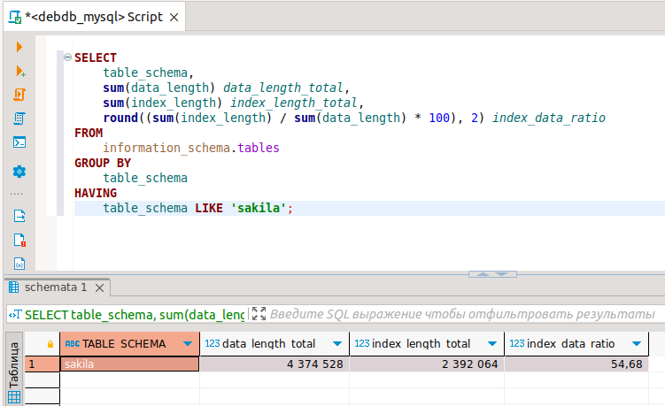

# Домашнее задание к занятию "`Индексы`" - `Аблогин Павел`


### Инструкция по выполнению домашнего задания

---

### Задание 1

1. `Написал запрос к учебной БД sakila, возвращающий процентное отношение общего размера всех индексов (index_length_total) к общему размеру всех таблиц (data_length_total).`
2. `Результат (index_data_ratio) округлен до двух чисел после запятой.`

```
sql-запрос для выполнения задания 1

SELECT 
	table_schema,
	sum(data_length) data_length_total,
	sum(index_length) index_length_total,
	round((sum(index_length) / sum(data_length) * 100), 2) index_data_ratio
FROM
	information_schema.tables
GROUP BY
	table_schema
HAVING 
	table_schema LIKE 'sakila';

```

`Результат выполнения задания 1`



---

### Задание 2

`Приведите ответ в свободной форме........`

1. `Заполните здесь этапы выполнения, если требуется ....`
2. `Заполните здесь этапы выполнения, если требуется ....`
3. `Заполните здесь этапы выполнения, если требуется ....`
4. `Заполните здесь этапы выполнения, если требуется ....`
5. `Заполните здесь этапы выполнения, если требуется ....`
6. 

```
Поле для вставки кода...
....
....
....
....
```

`При необходимости прикрепитe сюда скриншоты
`


---

### Задание 3

`Приведите ответ в свободной форме........`

1. `Заполните здесь этапы выполнения, если требуется ....`
2. `Заполните здесь этапы выполнения, если требуется ....`
3. `Заполните здесь этапы выполнения, если требуется ....`
4. `Заполните здесь этапы выполнения, если требуется ....`
5. `Заполните здесь этапы выполнения, если требуется ....`
6. 

```
Поле для вставки кода...
....
....
....
....
```

`При необходимости прикрепитe сюда скриншоты
`

### Задание 4

`Приведите ответ в свободной форме........`

1. `Заполните здесь этапы выполнения, если требуется ....`
2. `Заполните здесь этапы выполнения, если требуется ....`
3. `Заполните здесь этапы выполнения, если требуется ....`
4. `Заполните здесь этапы выполнения, если требуется ....`
5. `Заполните здесь этапы выполнения, если требуется ....`
6. 

```
Поле для вставки кода...
....
....
....
....
```

`При необходимости прикрепитe сюда скриншоты
`
