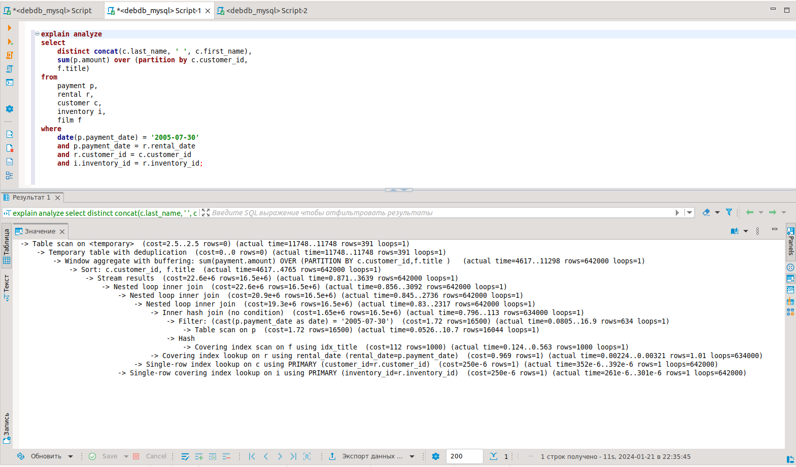
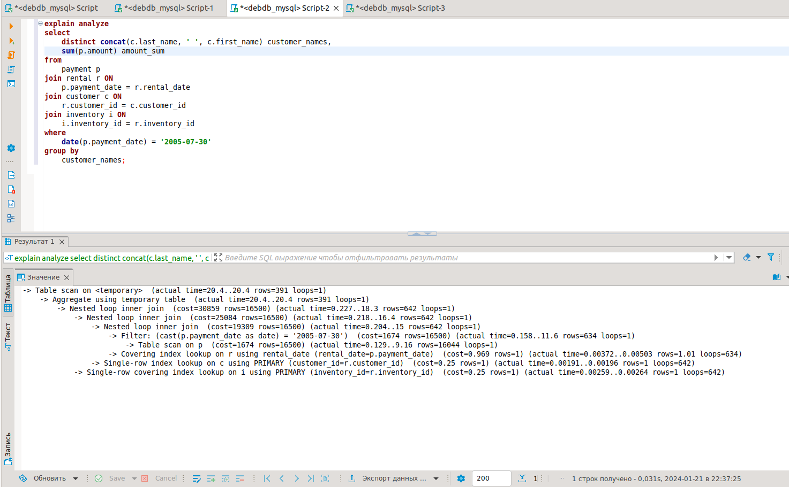
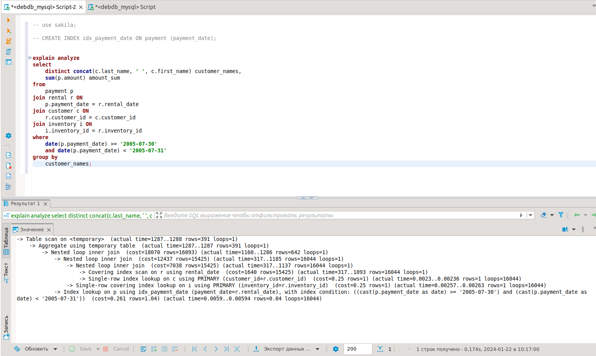

# Домашнее задание к занятию "`Индексы`" - `Аблогин Павел`


### Инструкция по выполнению домашнего задания

---

### Задание 1

1. `Написал запрос к учебной БД sakila, возвращающий процентное отношение общего размера всех индексов (index_length_total) к общему размеру всех таблиц (data_length_total).`
2. `Результат (index_data_ratio) округлен до двух чисел после запятой.`

```
sql-запрос для выполнения задания 1

SELECT 
	table_schema,
	sum(data_length) data_length_total,
	sum(index_length) index_length_total,
	round((sum(index_length) / sum(data_length) * 100), 2) index_data_ratio
FROM
	information_schema.tables
GROUP BY
	table_schema
HAVING 
	table_schema LIKE 'sakila';

```

`Результат выполнения задания 1`


---

### Задание 2

1. `Выполнил explain analyze для запроса из задания. Время выполнения запроса - 11 сек.`
2. `Узкими местами считаю использование оконной функции, для которой используется столбец film.title, а также несколько проверок в операторе WHERE.`
3. `Оптимизаровал запрос заменив проверки в WHERE операторами JOIN и убрав оконную функцию. Время выполнения снизилось до 0.031 сек`
4. `Таблицы в запросе уже содержат индексы PRIMARY KEY.`
5. `Добавил индекс в таблице payment на столбец payment_date. Изменил условие филтрации по дате в операторе WHERE.`

```
sql-запросы для выполнения задания 2

explain analyze 
select
	distinct concat(c.last_name, ' ', c.first_name) customer_names,
	sum(p.amount) amount_sum 
from
	payment p
join rental r ON
	p.payment_date = r.rental_date
join customer c ON
	r.customer_id = c.customer_id
join inventory i ON
	i.inventory_id = r.inventory_id
where
	date(p.payment_date) = '2005-07-30'
group by
	customer_names;


CREATE INDEX idx_payment_date ON payment (payment_date);


explain analyze 
select
	distinct concat(c.last_name, ' ', c.first_name) customer_names,
	sum(p.amount) amount_sum 
from
	payment p
join rental r ON
	p.payment_date = r.rental_date
join customer c ON
	r.customer_id = c.customer_id
join inventory i ON
	i.inventory_id = r.inventory_id
where
	date(p.payment_date) >= '2005-07-30'
	and date(p.payment_date) < '2005-07-31'
group by
	customer_names;

```

`Скриншоты выполнения задания 2`





---

